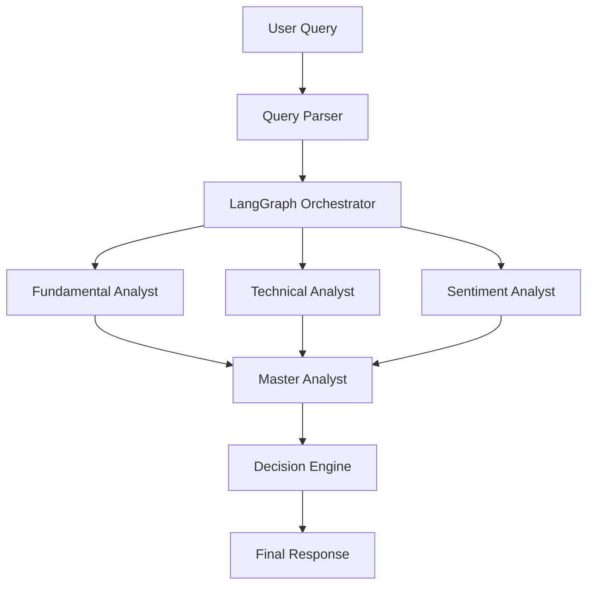
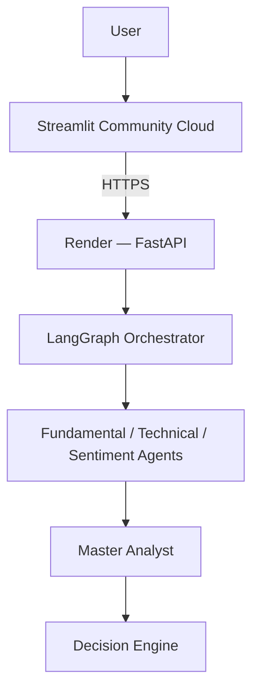

# 📈 Stock Market Analyst

**AI-powered multi-agent stock analysis for Indian equities.**

Stock Market Analyst is a modular AI system that evaluates Indian equities across fundamentals, technical indicators, and market sentiment. Instead of a single monolithic LLM prompt, specialized agents run in parallel, synthesize their outputs, and produce structured scores and narratives for single-stock, portfolio, and comparison queries.

[](https://www.python.org/)
[](https://github.com/langchain-ai/langgraph)
[](https://fastapi.tiangolo.com/)
[](https://streamlit.io/)
[](https://groq.com/)
[](https://render.com/)

| | |
|---|---|
| 🚀 **Live Demo** | [Streamlit App](https://indian-stock-market-analyst.streamlit.app/) |
| 📚 **API Documentation** | [OpenAPI Docs](https://stock-market-analyst-api.onrender.com/docs) |
| 💻 **GitHub Repository** | [pmpoopan/stock-market-analyst](https://github.com/pmpoopan/stock-market-analyst) |
| 🌐 **Live Backend** | [stock-market-analyst-api.onrender.com](https://stock-market-analyst-api.onrender.com) |

---

## Why This Project

Financial analysis is multi-dimensional. A useful view of a stock requires fundamentals, price action, and news sentiment — not a single score from one model call.

This project applies **specialized AI agents** for each dimension, orchestrated with **LangGraph**, with **deterministic Python** for all numeric work (indicators, metrics, scoring) and **LLMs only for interpretation** of structured outputs.

---

## What It Can Do

### 📊 Single Stock Analysis

**Example:** *"How is Reliance doing?"*

The system fetches market and financial data, runs parallel fundamental, technical, and sentiment analysis, synthesizes results through a Master Analyst, and returns an overall score, rating, key reasons, and risks.

### ⚖️ Stock Comparison

**Example:** *"Compare Tata Motors and Mahindra. Which has the stronger setup?"*

The system compares stocks side by side across fundamentals, technicals, sentiment, and risk, with relative narratives for valuation, growth, technical trends, and an optional overall leader.

### 💼 Portfolio Analysis

**Example:** *"How is my portfolio doing?"*

Provide multiple holdings (e.g. Tata Motors, Infosys, HDFC Bank) with quantity and buy price. The system analyzes each holding, aggregates P&L, allocation, sector concentration, portfolio score, and strongest/weakest positions.


---

## Multi-Agent Architecture



**Streamlit** calls the **FastAPI** backend, which parses the query and invokes the **LangGraph** workflow. The **Fundamental**, **Technical**, and **Sentiment** analysts execute **in parallel**. The **Master Analyst** synthesizes their outputs (agreement, disagreement, risks, catalysts). The **Decision Engine** computes weighted scores and ratings.

---

## Agent Responsibilities

| Agent | Responsibility |
|---|---|
| **Fundamental Analyst** | Financial health, valuation, growth, profitability, and derived fundamental metrics |
| **Technical Analyst** | Technical indicators, trend, momentum, volatility, and price/volume analysis |
| **Sentiment Analyst** | Recent news and web search results; sentiment classification and catalysts |
| **Master Analyst** | Combines analyst outputs into a coherent cross-perspective assessment |
| **Comparison / Portfolio agents** | Aggregates multi-stock or multi-holding results after the decision engine |

**Design principle:** LLMs **interpret** structured data; Python performs **deterministic calculations** (indicators, ratios, scoring).

---

## Architecture / Design Principles

| Layer | Responsibility |
|---|---|
| **Data layer** | Market data, OHLCV, financials, news — swappable providers |
| **Analysis layer** | Deterministic calculations, indicators, and metrics |
| **Agents** | LLM interpretation of structured agent outputs |
| **Graph** | LangGraph orchestration with parallel analyst execution |
| **API** | FastAPI backend, usable independently of Streamlit |
| **Frontend** | Streamlit UI |
| **Cache** | SQLite cache for quotes, historical data, financials, and search |

---

## Project Structure

```
Stock Market Analyst/
├── app/
│   ├── api/              # FastAPI routes, middleware, request schemas
│   ├── agents/           # Fundamental, Technical, Sentiment, Master, Comparison, Portfolio
│   ├── graph/            # LangGraph state, nodes, workflow, protocols
│   ├── data/             # Yahoo Finance, DuckDuckGo search, SQLite cache
│   ├── analysis/         # Indicators, metrics, scoring (deterministic)
│   ├── models/           # Pydantic domain schemas
│   ├── config/           # Settings and logging configuration
│   ├── services/         # Dependency injection container
│   └── main.py           # FastAPI app factory
├── frontend/
│   ├── streamlit_app.py  # Streamlit UI
│   └── ui_helpers.py     # Formatting helpers for the UI
├── tests/                # Pytest suite (mock data, no live LLM in default runs)
├── docs/
│   └── API.md            # Endpoint reference and examples
├── main.py               # Uvicorn entry point
├── requirements.txt
├── pytest.ini
└── .env.example
```

---

## Tech Stack

| Technology | Purpose |
|---|---|
| Python | Core application |
| LangGraph | Multi-agent orchestration |
| FastAPI | Backend API |
| Streamlit | Frontend UI |
| Groq | LLM interpretation |
| Yahoo Finance | Market and financial data |
| DuckDuckGo | Web/news search |
| SQLite | Caching |
| Pydantic | Data validation and schemas |
| Pytest | Testing |

---

## API

**Base URL (production):** `https://stock-market-analyst-api.onrender.com/api`

**Interactive docs:** [https://stock-market-analyst-api.onrender.com/docs](https://stock-market-analyst-api.onrender.com/docs)

| Method | Path | Description |
|---|---|---|
| `GET` | `/api/health` | Health check |
| `POST` | `/api/analyze` | Analyze a stock from a natural language query |
| `POST` | `/api/compare` | Compare two or more stocks |
| `POST` | `/api/portfolio` | Analyze portfolio holdings |

> **Note:** There is no route at `/api` alone. Use `/api/health` or `/docs`.

### Examples

**Health check**

```bash
curl https://stock-market-analyst-api.onrender.com/api/health
```

**Analyze a stock (local)**

```bash
curl -X POST "http://localhost:8000/api/analyze" \
  -H "Content-Type: application/json" \
  -d "{\"query\": \"How is Reliance doing?\"}"
```

**Compare stocks (local)**

```bash
curl -X POST "http://localhost:8000/api/compare" \
  -H "Content-Type: application/json" \
  -d "{\"stocks\": [\"TATAMOTORS.NS\", \"M&M.NS\"]}"
```

**Portfolio analysis (local)**

```bash
curl -X POST "http://localhost:8000/api/portfolio" \
  -H "Content-Type: application/json" \
  -d "{\"holdings\": [{\"symbol\": \"RELIANCE.NS\", \"quantity\": 10, \"buy_price\": 1000}]}"
```

**Windows (PowerShell)** — use `curl.exe` for the same commands:

```powershell
curl.exe https://stock-market-analyst-api.onrender.com/api/health

curl.exe -X POST "http://localhost:8000/api/analyze" -H "Content-Type: application/json" -d "{\"query\": \"How is Reliance doing?\"}"
```

See [docs/API.md](docs/API.md) for full request/response details.

---

## Local Setup

### 1. Clone the repository

```bash
git clone https://github.com/pmpoopan/stock-market-analyst.git
cd stock-market-analyst
```

### 2. Create and activate a virtual environment

**Windows**

```bash
python -m venv .venv
.venv\Scripts\activate
```

**macOS / Linux**

```bash
python -m venv .venv
source .venv/bin/activate
```

### 3. Install dependencies

```bash
pip install -r requirements.txt
```

### 4. Configure environment

```bash
copy .env.example .env        # Windows
# cp .env.example .env        # macOS/Linux
```

Set `GROQ_API_KEY` in `.env` for live LLM interpretation. Without it, the backend uses `MockLLMClient`.

### 5. Start the FastAPI backend

```bash
python main.py
```

- Health: [http://localhost:8000/api/health](http://localhost:8000/api/health)
- Docs: [http://localhost:8000/docs](http://localhost:8000/docs)

### 6. Start Streamlit (second terminal)

```bash
streamlit run frontend/streamlit_app.py
```

- UI: [http://localhost:8501](http://localhost:8501)

The Streamlit app calls the API at `API_BASE_URL` (default `http://localhost:8000/api`), configurable in `.env` or the sidebar.

---

## Testing

The default test suite uses **mock market data**, **mock news search**, and **MockLLMClient** — no live Groq or Yahoo Finance calls are required.

```bash
pytest          # run all tests
pytest -v       # verbose
```

**146 tests** in the suite (`pytest.ini` configures `asyncio_mode = auto`).

---

## Scoring Model

Default weights (configurable via `.env`):

| Factor | Weight |
|---|---|
| Fundamental | **40%** |
| Technical | **35%** |
| Sentiment | **15%** |
| Risk | **10%** |

**Ratings:** Strong Buy · Buy · Hold · Avoid

Thresholds and weights are configurable through environment variables (`WEIGHT_*`, `RATING_*` in `.env.example`).

---

## Deployment



| Component | Platform |
|---|---|
| Frontend | Streamlit Community Cloud |
| Backend | Render |
| Source | GitHub |

**Production backend:** [https://stock-market-analyst-api.onrender.com](https://stock-market-analyst-api.onrender.com)

**Streamlit → API:** Set `API_BASE_URL` to `https://stock-market-analyst-api.onrender.com/api` in Streamlit secrets or environment.

**Backend secrets (Render):** Configure `GROQ_API_KEY` and other settings via Render environment variables — **never commit secrets to GitHub**.

**SQLite cache:** Stored under `/data/` at the repository root (ignored by Git; not the `app/data/` source package).

---

## Development Status

| Phase | Scope | Status |
|---|---|---|
| 1 | Project structure + configuration | ✅ Complete |
| 2 | Yahoo Finance + caching | ✅ Complete |
| 3 | Technical indicator engine | ✅ Complete |
| 4 | Technical Analyst | ✅ Complete |
| 5 | Fundamental data + Analyst | ✅ Complete |
| 6 | Web search + Sentiment Analyst | ✅ Complete |
| 7 | LangGraph orchestration | ✅ Complete |
| 8 | Master Analyst + Decision Engine | ✅ Complete |
| 9 | Portfolio Analyzer | ✅ Complete |
| 10 | Comparison workflow | ✅ Complete |
| 11 | Streamlit UI | ✅ Complete |
| 12 | Testing, logging, and documentation | ✅ Complete |
| 13 | Cloud deployment | ✅ Complete |

---

## Future Roadmap

- Backtesting
- Watchlists
- Price alerts
- Additional technical indicators
- Improved news and source attribution
- Historical recommendation tracking
- Agent confidence scores
- Portfolio P&L visualization
- Advanced risk analytics
- Persistent production database
- User authentication

---

## Disclaimer

**This project is for educational and analytical purposes only.** It does not provide guaranteed predictions or financial advice. Users should conduct their own research and consider their own risk tolerance before making investment decisions.

---

Built as an exploration of multi-agent AI systems for financial analysis.

**Python** · **LangGraph** · **FastAPI** · **Streamlit** · **Groq** · **Yahoo Finance**
